# Police Stop Outcome

## Team members

| Name             | GitHub username |
| ---------------- | --------------- |
| Akash Aggarwal   | Akash15o3       |
| Anthony Minaise  | anthonyminaise  |
| Jayasurya Pinaki | jayasurya17     |
| Sri Hari Duvvuri | duvvurisrihari  |

## Data Source

We plan on using the Stanford Open Policing Project dataset from Kaggle. [https://www.kaggle.com/faressayah/stanford-open-policing-project](https://www.kaggle.com/faressayah/stanford-open-policing-project)

## Description

Due to the recent police activity and call for police reform over the past few months, we want to predict the outcome of a police stop based on a variety of attributes. We thought of the idea based on recent events around police reform and wanted to implement some way to see what happens and what will happen at a police stop. We want to look into what factors are reported for a police stop and see what will be the most important when predicting the stop_outcome.

## Need for the Project

Predicting a type of crime before it happens is an essential part of crime patrolling. Police officers make over 50,000 traffic arrests on an average day in the United States. This project requires attention to answer some questions that results into a stop by police. Some of these needs are :

1. How often a driver is friskd?
2. How does drug activity change according to the time of the day?
3. Does more stops happen at night or the day?
4. Does gender play a factor resulting in a police stop?

### Prediction

The stop_outcome column is what happens after an officer concludes a stop on a person, whether its for a citation, arrest, warning, or other possible outcomes. After performing a test train split on the dataset, we want to predict the stop_outcome using a few different machine learning algorithms to determine which algoirthm predicts the best for the given dataset.

## Potential Methods

### Preprocessing

For preprocessing, we were thinking about using One Hot encoding (using pandas get_dummies), perform some test training split on the dataset, and some dimensionality reduction after running on the training set.

Ex: Change stop time from exact time stamps to time of the day (12AM-3AM, 3AM-6AM and so on)

### Methods Considered

We were thinking about using decision trees, random forest or k-nearest neighbors. We want to use at least 2-3 algorithms to see which one would give the best accuracies and report the outcome. We aren't too well versed in some of these algorithms, so we are not sure how the implementation will end up. We want to use this project as a chance to dive deeper into different algorithms and figure out how they work and how they are implemented after being preprocessed.

- Decision Trees: It would be our first choice of metric and we will start classifying the data considering parameters like violation type, gender, time and so on thus reaching the stop outcome as our final branch. Henceforth, extracting a tree model depicting results.

- KNN: This will match data points given as input to the information available in the dataset. The prediction will be based on the closest match to a stop that happened in the past.

- Random Forest: Multiple trees are grown instead of just one tree in decision tree algorithm. When a new object is given, the classification happens based on number of votes by the trees and it takes the average of the outputs in case of regression. This algorithm will also handle missing values and maintains accuracy for missing data. Additionally, it will not overfit the model as well.

## Metrics to Measure Success

We’ll measure success based on the accuracy of the test dataset portion of the population dataset after running the algorithms on the training set. We will divide our dataset into a 70-30 split for training and testing. We hope to reach around 85-90% accuracy for the models.

In the perspective of the project, Our aim is to assist researchers, journalists and policymakers in researching and improving police-public interactions.

## Outcome

At the end of the project, we want to be able to present statistics visually on the different algorithms on how they predicted versus what the actual stop_outcomes were. Based on the different columns like driver_race, stop_time, driver_age, search_conducted, violation, and gender, we want to use these as parameters to be passed into our model and predict the stop_outcome that can act as an additional assistance to the police force.

# Preliminary Analysis Writeup

To perform Preliminary Preprocessing and Visualization, each member of the group is given 4 columns to perform different operations as the total number of columns are 16.

- Akash Aggarwal - Columns 5 to 8.
- Anthony Minaise- Columns 13 to 15
- Jayasurya Pinaki-Columns 9 to 12
- Sri Hari Duvvuri- Columns 1 to 4

## Columns 1 to 4

The columns present in this section are Stop_time, Stop_year, gender of the person and the county name. The county name can be dropped from the dataset because the county name is completeley null and it is not affecting the result.

The gender column contains nulls for some of the rows. The null values consitute of around 5% of the total values. Since the dataset is large enough, it is fine to discard the null values than replacing them with random or mode values.

### Column: stop_date

- **Datatype:** String
- **Description:** It is the date on which the search was conducted by the police officer after the vehicle was stopped
- **Values:** Dates in YYYY-MM--DD format.

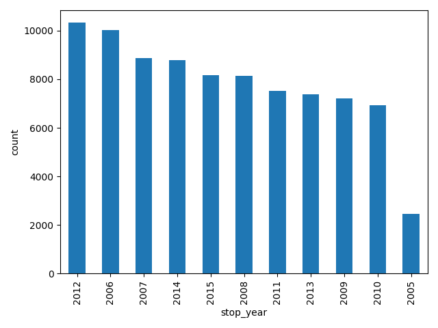

**Observations**

- The dates are visualized by plotting the number of stop outcomes happening per yer. This bar graph provides some insight about the stop outcomes. When plotted we can see that the year 2012 has the highest number of stop outcomes while 2005 has the least.

### Column: stop_time

- **Datatype:** String
- **Description:** It is the time of the day on which the search was conducted by the police officer after the vehicle was stopped

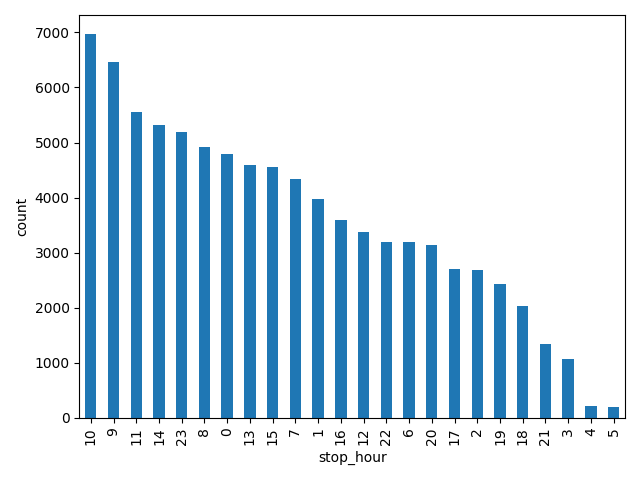

**Observations**

- Times in the morning and afternoon have the highest stop outcomes, with 11pm, 12am being some exception.

### Column: county_name

- **Datatype:** String
- **Values:** Contains All Nulls
- **Description:** Describes the county name where the search was conducted by the police officer after the vehicle was stopped

**Observations**

- All the values are empty, so this column has no affect on the stop, hence deleting this column

**Result:** This column can be deleted

### Column: driver_gender

- **Datatype:** String
- **Values:** Male , Female
- **Description:** Describes wthe gender of the driver wheb search is conducted by the police officer after the vehicle was stopped

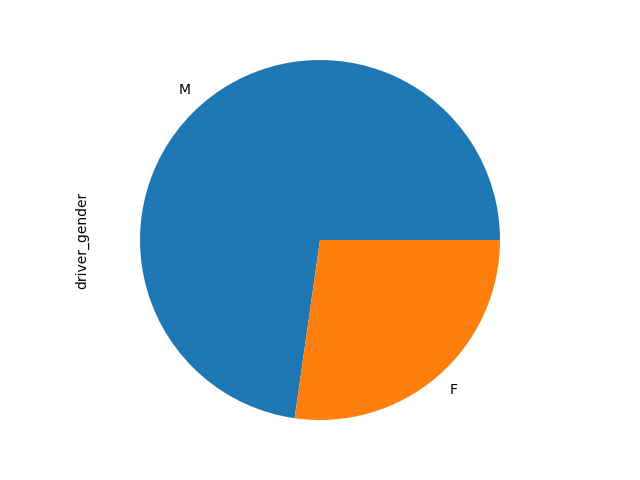

The graph between Gender and the hour of incident is as follows. Here the graph displays the variation of stop count with day of the hour also considering the gender into account.

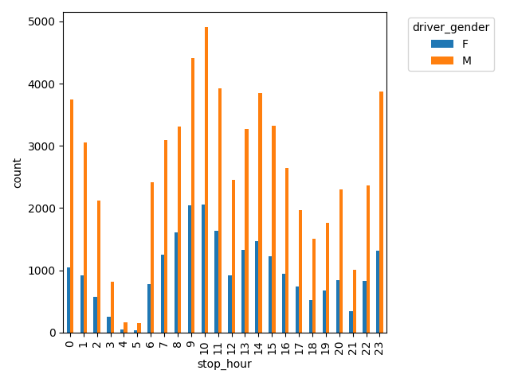

The graph between Gender and the year of incident is as follows. Here the graph displays the variation of stop count with the year also considering the gender into account.

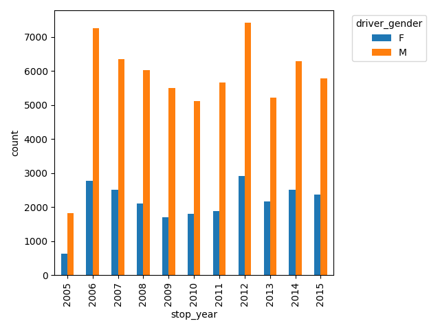

**Observations**

- Males have a higher chance of getting stopped over females

## Columns 5 to 8

The columns present in subsequent section are Driver_age_raw, Driver_age, Driver_race,Violation_raw.

### Column: driver_age_new

- **Datatype:** Integer
- **Description:** Describes the age of the driver at the time of police stop.

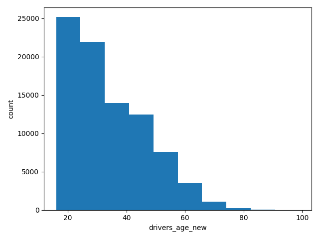
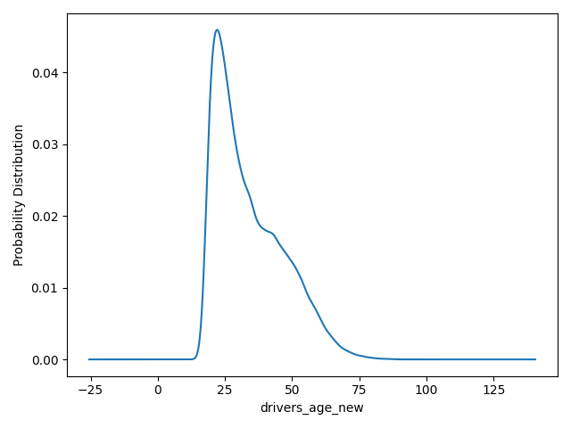

**Observations**

- It was observed that count of stopped drivers who were above 20 and less than 30 are the highest.
- The KDE curve represents the same information that probability density of driver's age is maximum between 20 and 30.
- In the dataset by checking null values, it is observed that the age of driver was never less than 16 since its illegal to drive.

**Result:** The rows with null values and incorrect values determined by subtracting stop year and date of birth of the driver are replaced with average value of driver's age column.

### Column: driver_age_raw

- **Datatype:** Integer
- **Description:** Describes the year of birth of the driver at the time of police stop.

**Observations**

- Driver's year of birth is pivot in finding incorrect data entry in Driver's age column.
- This column does not provide any significant value to the dataset itself

**Result:** This column can be deleted

### Column: driver_race

- **Datatype:** String
- **Description:** Describes the race of the driver who were stopped by the police.

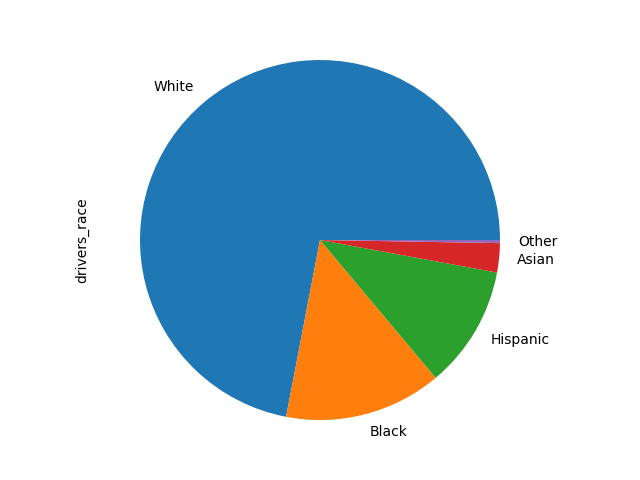

**Observations**

- Most of the stops that occur, it has been found that the race of driver is White.
- This column provide insight into relation between race of driver and stop outcome and will be useful during classification

**Result:** The rows with null values are replaced with most frequent value.

### Column: violations_raw

- **Datatype:** String
- **Description:** Describes the violation type done by driver that resulted in a stop by police

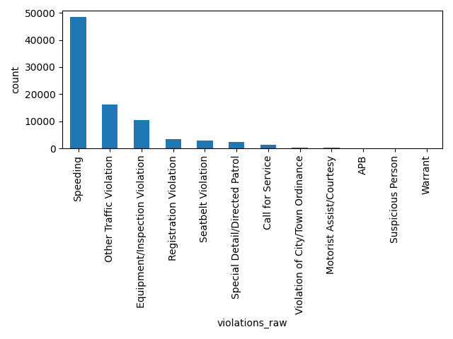

**Observations**

- It is observed that speeding is the most frequent kind of violation that resulted in a police stop
- The count of stops due to speeding are greater than 50% compared to other types of violation
- Other traffic violations are second most factor that causes a stop by police.

**Result:** The rows with null values are replaced with most frequent value.

## Columns 9 to 12

### Column: violation

- **Datatype:** String
- **Values:** Equipment, Moving violation, Other, Registration/plates, Seat belt, Speeding
- **Description:** Describes the violation the person has committed

**Observations**

- Speeding is the most frequently committed violation throughout the day
- Number of violations peak between 9AM-11AM and again between 10PM-1AM
- 4AM-5AM has the least number of violations

### Column: search_conducted

- **Datatype:** Boolean
- **Description:** Describes if any search was conducted by the police officer after the vehicle was stopped

**Observations**

- Most of the stops don't cause a search to be conducted by the police offer
- This column does not provide any significant value to the dataset itself

**Result:** This column can be deleted

### Column: search_type

- **Datatype:** String
- **Values:** Intend to Arrest, Probable Cause, Inventory, Reasonable Suspicion, Protective Frisk
- **Description:** Describes what type of search was conducted by the police officer after the vehicle was stopped

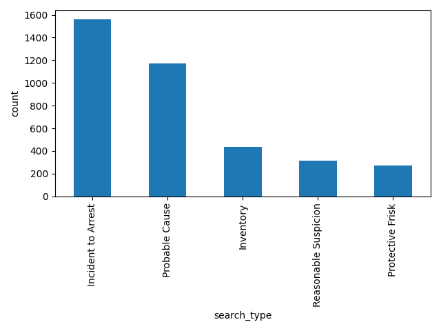

**Observations**

- Some stops had multiple searches conducted and this was recorded as comma separated values. When a single stop had multiple searches conducted, each search type was split into its own row so that all the values in this column are atomic
- Incident to arrest is the most common search_type that has occurred

**Result**
- Since this column has a combination of these five values, each type of seach is assigned a weight and transformed to a numeric value
- This value is stored in the column search_type_score
- The following steps are done to calculate the score

1. Assign position for each of the values that can occur as a type of search. Example: (Intend to Arrest, Probable Cause, Inventory, Reasonable Suspicion, Protective Frisk, No arrest)
2. Each of the value will be initialized to 0
3. If any of the search type occurs then change the value to 1
4. Convert the binary representation to integer representation
 

### Column: stop_outcome

- **Datatype:** String
- **Values:** Arrest Driver, Arrest Passenger, Citation, N/D, No Action, Warning
- **Description:** Describes what type of search was conducted by the police officer after the vehicle was stopped

**Observations**

- Citation is the most common outcome for any kind of violation

## Columns 13 to 15

### Column: is_arrested

- **Datatype:** Boolean
- **Description:** Describes if an arrest was made for a given stop

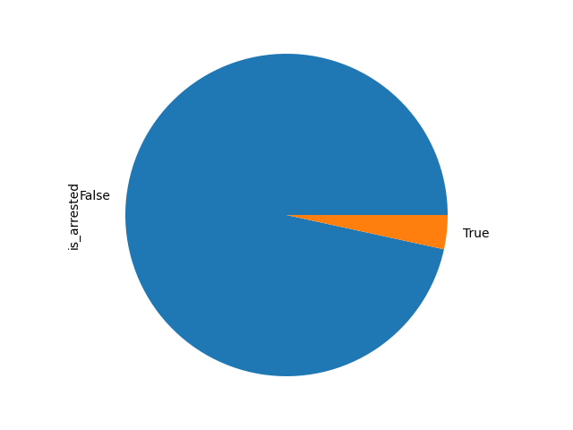

**Observations**

- Based on the stop_outcome column, only the stop outcomes that are Arrest Driver or Arrest Passenger are true for this column
- 92% of the not arrested stops are citations

### Column: stop_duration

- **Datatype:** String
- **Values:** 0-15 Min, 16-30 Min, 30+ Min
- **Description:** Describes how long a police stop takes

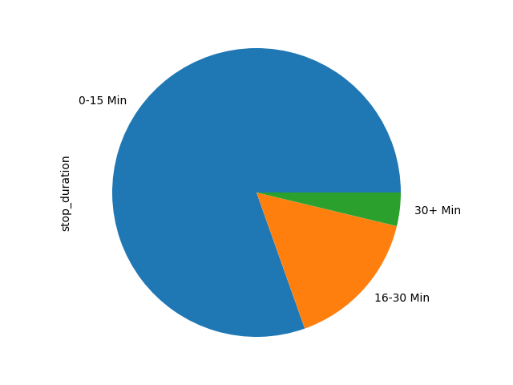

**Observations**

- Majority of the police stops take less than 16 minutes
- Of the stops that are 30+ minutes, seems like more of the stops end up in arrest
- Of the stops thare are 16-30 minutes, majority of the stops do not end up in an arrest
- Of the stops thare are 0-15 minutes, a vast majority of the stops do not end up in an arrest

### Column: drugs_related_stop

- **Datatype:** Boolean
- **Description:** Describes if a stop had drugs involved

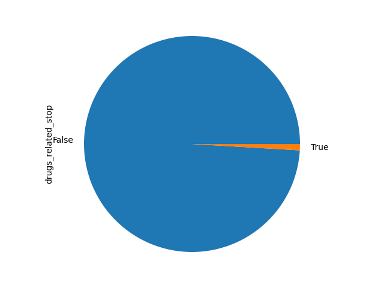

**Observations**

- A small subset of the true drug related stops, around 26%, ended up in arrest
- Around 3% of the not drug related stops ended up in an arrest
