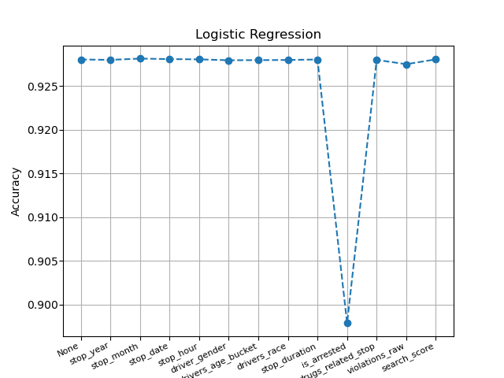

# **Final Report**

# Abstract
Due to the recent police activity and call for police reform over the past few months, we want to predict the outcome of a police stop based on a variety of attributes. We thought of the idea based on recent events around police reform and wanted to implement some way to see what happens and what will happen at a police stop. We want to look into what factors are reported for a police stop and see what will be the most important when predicting the stop_outcome.

# Experiments/Analysis
We decided to run the dataset on four different models, Random Forest, Decision Tree, K Nearest Neighbors, and Logistic Regression, to see how the models will perform. We also wanted to find some other details like which column is most important to predict the stop_outcome and if different depths on Decision Tree would make a difference.

## Random Forest
We chose random forest as a model to try out because random forests can be influenced less by outliers and that random forest provides a better understanding of the relationship features have with the target and the kind of influence they have on the dataset. The way we implemented Random Forest was to put the model inside of Grid Search to best find the hyperparameters to use. There were a couple approaches we tried on the model. 

Using GridSearchCV, we found the best parameters out of a list of parameters for n_estimators and max_depth to use on the random forest model. Grid search will loop through every possibility in `param_grid` and test it on the model and save the best parameters to use. In the end, `n_estimators` as 250 and `max_depth` as None proved to be the best parameters to run random forest on. The code block below shows the `param_grid` use to find the best parameters:

```
# Find best parameters to run the model most efficently
# Set the parameters you want to evaluate
param_grid = {'n_estimators': [50,75,100,150,200,250,300,350,400,450,500],
	 		  'max_depth': [None,1,2,3,4,5,10,20,30,50,75,100,150]
    		 }
```

The next piece of information we wanted to find out was which column(s) impact the prediction of the `stop_outcome` column. In order to do so, we looped through the dataset and removed each column individually, retrain the model, predict the outcome, and see which cross validation scores came back lower than most. In the end, random forest saw that when `is_arrested` column has the lowest cross validation score, which meant that column is important in predicting the `stop_outcome` column. Which makes sense considering there are only five different outcomes and if they end up arrested, they will have gotten a specific outcome like arrest driver or passenger. The graph for this can be seen in the Comparison section below.

One last approach in analyzing the model is how accurate it was predicting the `stop_outcome`. By calling the `find_accuracy_of_each_class` method in the `common_utils.py` file, we were able to see the accuracy the model is having in identifying each `stop_outcome` type. We put this method after each time we run the loop mentioned in the previous paragraph and the accuracy looked like the following table with given a +/- 0.002 margin.

| stop_outcome |  accuracy |
| --------- | --------------- |
|     Arrest Driver |  1.000000 |
|  Arrest Passenger | 1.000000 | 
|          Citation |  0.843259| 
|         No Action | 1.000000| 
|           Warning |  0.967047| 

## Decision Tree
* Apply Decision Tree classifier algorithm on the dataset and compare how different approaches in implementing the algorithm impacts the accuracy
* The first approach is to find out the best parameters using the grid search
* In the second approach we try to remove individually one column at a time and try to find out 
  the accuracy respectively. This way we can find out which column is affecting the outcome much or
  indicating the importance of each column
* The third approach is to find accuracy by varying the depth. The Depth parameter for the Decision classifier
  is varied. For various depths the accuracy is calculated. The increase in the maximum depth causes the algorithm to overifit, hence higher depths are not preferred

## K Nearest Neighbors
Apply KNN algorithm on the dataset and compare how different approaches in implementing the algorithm impacts the accuracy
1) The first approach is to apply KNN on the entire dataset by selecting n number of neighbours
2) The second approach is to reduce the dataset into n number of features and then apply KNN on the dataset
3) The third approach is to find accuracy by using cross_val_score with 5 folds on KNN
4) Finally, drop one column at a time and find the importance of each column in the dataset


* On looking at the above graph we notice that accuracy of KNN with and without cross_val_score is almost the same. It starts at the same accuracy and slowly moves further away but the difference is more or less the same always. This indicates that the model is not overfitted or underfitted. Also, as expected the accuracy decreases by considering higher number of neighbours for analysis.
* By looking at the following results where the accuracy of prediction of each outcome is mentioned, we observe that the ideal value for K must be 15 where it is not too biased towards a few outcomes or too low for other outcomes
	- Prediction accuracy of each class using KNN with 5 neighbors

	| stop_outcome |  accuracy |
	| --------- | --------------- |
	|     Arrest Driver |  0.953954 |
	|  Arrest Passenger | 1.000000 | 
	|          Citation |  0.568627| 
	|         No Action | 1.000000| 
	|           Warning |  0.775100| 

	- Prediction accuracy of each class using KNN with 15 neighbors

	| stop_outcome  | accuracy| 
	|---------------|---------|
	| Arrest Driver  | 0.788288| 
	| Arrest Passenger  | 1.000000| 
	| Citation  | 0.562594| 
	| No Action  | 0.993988| 
	| Warning  | 0.689759| 

	- Prediction accuracy of each class using KNN with 25 neighbors

	| stop_outcome  | accuracy| 
	|----------------|---------|
	| Arrest Driver | 0.681181| 
	| Arrest Passenger  | 0.994074| 
	| Citation  | 0.556058| 
	| No Action  | 0.937876| 
	| Warning  | 0.663153| 


* The above plot was obtained by running KNN with 15 neighbours. The original dataframe has about 82 features and reducing that to very low number of features will make the dataframe lose a lot of information and that is reflected in the graph where we see the accuracy is very low.
* The ideal number of components would be anything above 13. For all values above 13 components, there is not much significant difference we notice in prediction


## Logistic Regression


# Comparisons

In following graphs, we remove one column at time and look at the accuracy with which each of the models is able to predict/classify. We notice that the accuracy decreases upon removing column is_arrested in each of the methods. This indicates that is_arrested is the most important column in this data since this directly leads to either arrest of driver or passenger.

* Accuracy using KNN 


* Accuracy using Random Forest


* Accuracy using Decision Tree


* Accuracy using Logistic Regression



Comparing what we did in our project to the [Kaggle competition](https://www.kaggle.com/faressayah/stanford-open-policing-project) we got our dataset from, we seem to have had different goals and approaches to preprocessing. When looking at the notebooks associated, it looks like people were trying to answer questions like "Do men or women speed more often?" and "Which year had the least number of stops?" while our project aimed to predict the `stop_outcome`. Also, the preprocessing and visualization done in the Kaggle notebooks seemed to go more in depth about distributions within some of the columns, which in retrospect would have been good for us to do in our preliminary analysis.

# Conclusion