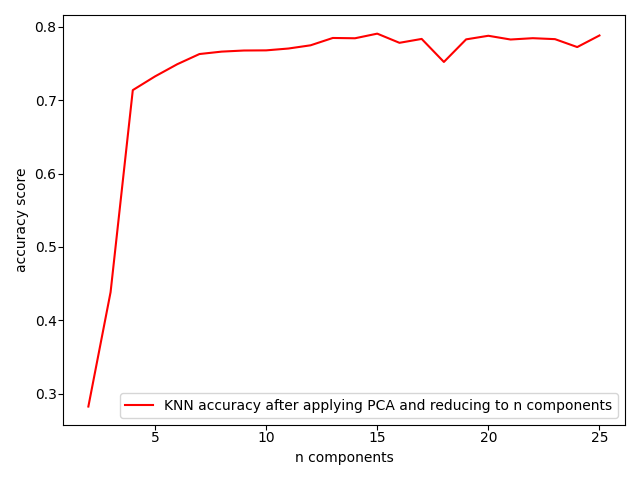

# **Final Report**

# Abstract
Due to the recent police activity and call for police reform over the past few months, we want to predict the outcome of a police stop based on a variety of attributes. We thought of the idea based on recent events around police reform and wanted to implement some way to see what happens and what will happen at a police stop. We want to look into what factors are reported for a police stop and see what will be the most important when predicting the stop_outcome.

# Experiments/Analysis
We decided to run the dataset on four different models, Random Forest, Decision Tree, K Nearest Neighbors, and Logistic Regression, to see how the models will perform. We also wanted to find some other details like which column is most important to predict the stop_outcome and if different depths on Decision Tree would make a difference.

## Random Forest
<!-- Include dropping columns graph under comparisions section and delete this comment -->

## Decision Tree
<!-- Include dropping columns graph under comparisions section and delete this comment -->
* Apply Decision Tree classifier algorithm on the dataset and compare how different approaches in implementing the algorithm impacts the accuracy
* The first approach is to find out the best parameters using the grid search
* In the second approach we try to remove individually one column at a time and try to find out 
  the accuracy respectively. This way we can find out which column is affecting the outcome much or
  indicating the importance of each column
* The third approach is to find accuracy by varying the depth. The Depth parameter for the Decision classifier
  is varied. For various depths the accuracy is calculated. The increase in the maximum depth causes the algorithm to overifit, hence higher depths are not preferred

## K Nearest Neighbors
Apply KNN algorithm on the dataset and compare how different approaches in implementing the algorithm impacts the accuracy
1) The first approach is to apply KNN on the entire dataset by selecting n number of neighbours
2) The second approach is to reduce the dataset into n number of features and then apply KNN on the dataset
3) The third approach is to find accuracy by using cross_val_score with 5 folds on KNN
4) Finally, drop one column at a time and find the importance of each column in the dataset

* On looking at the above graph we notice that accuracy of KNN with and without cross_val_score is almost the same. It starts at the same accuracy and slowly moves further away but the difference is more or less the same always. This indicates that the model is not overfitted or underfitted. Also, as expected the accuracy decreases by considering higher number of neighbours for analysis.
* By looking at the following results where the accuracy of prediction of each outcome is mentioned, we observe that the ideal value for K must be 15 where it is not too biased towards a few outcomes or too low for other outcomes
	- Prediction accuracy of each class using KNN with 5 neighbors

	| stop_outcome |  accuracy |
	| --------- | --------------- |
	|     Arrest Driver |  0.953954 |
	|  Arrest Passenger | 1.000000 | 
	|          Citation |  0.568627| 
	|         No Action | 1.000000| 
	|           Warning |  0.775100| 

	- Prediction accuracy of each class using KNN with 15 neighbors

	| stop_outcome  | accuracy| 
	|---------------|---------|
	| Arrest Driver  | 0.788288| 
	| Arrest Passenger  | 1.000000| 
	| Citation  | 0.562594| 
	| No Action  | 0.993988| 
	| Warning  | 0.689759| 

	- Prediction accuracy of each class using KNN with 25 neighbors

	| stop_outcome  | accuracy| 
	|----------------|---------|
	| Arrest Driver | 0.681181| 
	| Arrest Passenger  | 0.994074| 
	| Citation  | 0.556058| 
	| No Action  | 0.937876| 
	| Warning  | 0.663153| 

* The above plot was obtained by running KNN with 15 neighbours. The original dataframe has about 82 features and reducing that to very low number of features will make the dataframe lose a lot of information and that is reflected in the graph where we see the accuracy is very low.
* The ideal number of components would be anything above 13. For all values above 13 components, there is not much significant difference we notice in prediction

## Logistic Regression
<!-- Include dropping columns graph under comparisions section and delete this comment -->

# Comparisons

In following graphs we remove one column at time and look at the accuracy with which each of the models is able to predict/classify. We notice that the accuracy decreases upon removing column is_arrested in each of the methods. This indicates that is_arrested is the most important column in this data since this directly leads to either arrest of driver or passenger.

* Accuracy using KNN 

# Conclusion