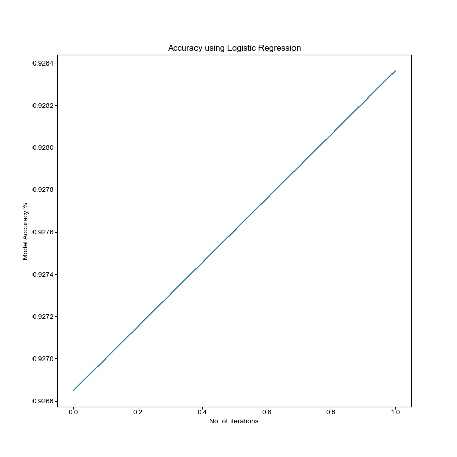
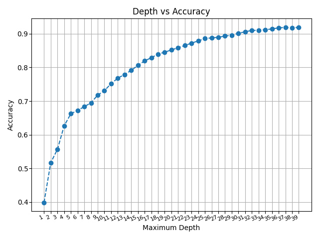
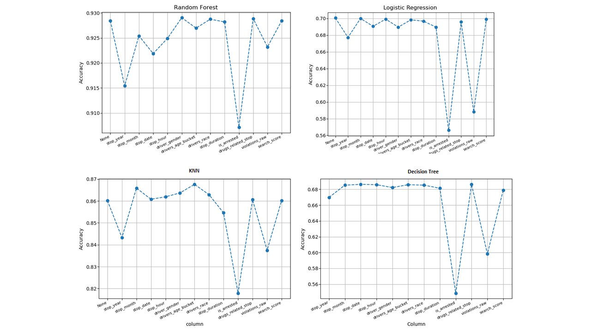
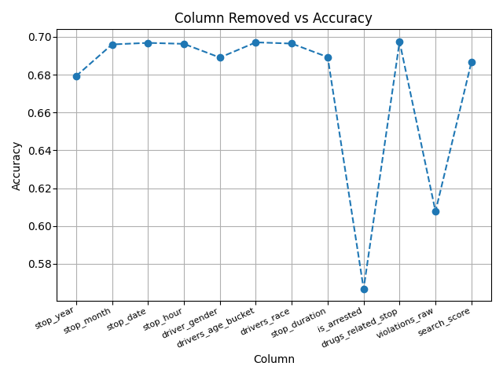

# **Final Report**

# Abstract

Due to the recent police activity and call for police reform over the past few months, we want to predict the outcome of a police stop based on a variety of attributes. We thought of the idea based on recent events around police reform and wanted to implement some way to see what happens and what will happen at a police stop. We want to look into what factors are reported for a police stop and see what will be the most important when predicting the stop_outcome.

We aimed to use four different models: random forest, decision tree, logistic regression, and k nearest neighbors. We wanted to compare how each model would perform against each other and which would be the best to predict the stop_outcome. Each model went through similar approaches when it came to testing like removing each column to see which column proved to be important in the prediction.

# Experiments/Analysis

We decided to run the dataset on four different models, Random Forest, Decision Tree, K Nearest Neighbors, and Logistic Regression, to see how the models will perform. We also wanted to find some other details like which column is most important to predict the stop_outcome, how number of iterations affect Logistic Regression and if different depths on Decision Tree would make a difference.

## Logistic Regression

We chose to perform Logistic Regression model for training our data since it is very effective in predicting categorical labels and since our Stop Outcome has categorical values like Arrest Driver, Arrest Passenger, Citation, No Action and Warning, it is good Supervised Model to train and test data on. The way we implemented Logistic Regressio was to put the model inside of Grid Search to best find the hyperparameters to use. There were a couple approaches we tried on the model.

- First Approach - Using GridSearchCV, we found the best parameters out of a list of parameters for primarily `Inverse regularization parameter` that is control variable that retains strength modification of Regularization by being inversely positioned to the Lambda regulator and `max_itr` that defines the number of iterations our model will train on. Grid search will loop through every possibility in `param_grid` and test it on the model and save the best parameters to use. In the end, `Inverse regularization parameter` as 1 and `max_itr` as 10,000 proved to be the best parameters to run logistic regression on. The code block below shows the `param_grid` use to find the best parameters:

```
# Find best parameters to run the model most efficently
# Set the parameters you want to evaluate
param_grid ={'C':[0.001, 0.1, 1, 10, 100],
'max_iter':[10000]
}
```



- From the graph above, it can be concluded with increase in number of iterations, the accuracy definitely increase but having too high or too low iterations have consequences. The repurcussions are discussed here:

- If we set `max_itr` too low, then the Logistic Regression has too little training to converge and therefore throw an exception.
- If we set the `max_itr` too high, then the Logistic Regression simply overfits the training data without capturing useful patterns.


-Second Approach- Based on the analysis of Confusion Matrix above,it was clear that the data is inbalanced with citation being the dominant. So we did sampling of the data, either downsampling or upsampling to a value where we have equal balance of data and then again trained our models

-Third Approach - We tried figuring out column(s) impact the prediction of the `stop_outcome` column on resampled data. In order to do so, we looped through the dataset and removed each column individually, retrain the model, predict the outcome, and see which cross validation scores came back lower than most. In the end, Logistic Regression saw that when `is_arrested` column has the lowest cross validation score, which meant that column is important in predicting the `stop_outcome` column. It confirms the fact that when `is_arrested` column is true, the stop outcome would result into arrest driver or passanger by removing this column, we are loosing a lot of information.

-Fourth Approach - The final approach is to analyze the precision of model in predicting the `stop_outcome`.

| stop_outcome     | Precision |
| ---------------- | --------- |
| Arrest Driver    | 0.68      |
| Arrest Passenger | 0.67      |
| Citation         | 0.67      |
| No Action        | 0.86      |
| Warning          | 0.64      |

## Random Forest

We chose random forest as a model to try out because random forests can be influenced less by outliers and that random forest provides a better understanding of the relationship features have with the target and the kind of influence they have on the dataset. Random forest is good because having a large number of trees that work together will outperform individual models. The way we implemented Random Forest was to put the model inside of Grid Search to best find the hyperparameters to use. There were a couple approaches we tried on the model.

Using GridSearchCV, we found the best parameters out of a list of parameters for n_estimators and max_depth to use on the random forest model. Grid search will loop through every possibility in `param_grid` and test it on the model and save the best parameters to use. In the end, `n_estimators` as 250 and `max_depth` as None proved to be the best parameters to run random forest on. The code block below shows the `param_grid` use to find the best parameters:

```
# Find best parameters to run the model most efficently
# Set the parameters you want to evaluate
param_grid = {'n_estimators': [50,75,100,150,200,250,300,350,400,450,500],
	 		  'max_depth': [None,1,2,3,4,5,10,20,30,50,75,100,150]
    		 }
```

The next piece of information we wanted to find out was which column(s) impact the prediction of the `stop_outcome` column. In order to do so, we looped through the dataset and removed each column individually, retrain the model, predict the outcome, and see which cross validation scores came back lower than most. In the end, random forest saw that when `is_arrested` column has the lowest cross validation score, which meant that column is important in predicting the `stop_outcome` column. Which makes sense considering there are only five different outcomes and if they end up arrested, they will have gotten a specific outcome like arrest driver or passenger. The graph for this can be seen in the Comparison section below.

One last approach in analyzing the model is how accurate it was predicting the `stop_outcome`. By calling the `find_accuracy_of_each_class` method in the `common_utils.py` file, we were able to see the accuracy the model is having in identifying each `stop_outcome` type. We put this method after each time we run the loop mentioned in the previous paragraph and the accuracy looked like the following table with given a +/- 0.002 margin.

Since decision trees and random forests are similar, we compared the two when testing out the models. For example, I would test out different `max_depths` that decision tree saw that were good to see if it would translate to random forest.

Lastly, we figured later into the project that we should have resampled our data. So we compared our original preprocessed data with the resampled data to see if the resampled data helped improve accuracy in our models. In the end, random forest gave an accuracy of around 94% with the resampled data and the original data gave around 92%. Trends between the two outputs are really similar, only around a 2% difference in accuracies because of the way the resampling works (explained in the conclusion).

### Accuracy with original and resampled data
| stop_outcome     | Accuracy with original data | Accuracy with resampled data |
| ---------------- | -------- |-------- |
| Arrest Driver    | 1.000000 |1.000000 |
| Arrest Passenger | 0.030303 |1.000000 |
| Citation         | 0.995253 |0.780292 |
| No Action        | 0.293578 |1.000000 |
| Warning          | 0.036765 |0.919177 |

## Decision Tree

We used the decision tree classification technique to predict the stop outcome and understand how the classification works based on the rules it generates over the coloumns. So the various columns affecting the output would be considered by the decision tree. The outcome is based on the contents of the leaf node, and the conditions along the path form a conjunction in the if clause. In general, we have worked on the following approaches in decision trees to understand the importance of each columns and obtain the best predictions.

Apply Decision Tree classifier algorithm on the dataset and compare how different approaches in implementing the algorithm impacts the accuracy

- The first approach is to find out the best parameters using the grid search

- In the second approach we try to find the accuracy by varying the depth. The Depth parameter for the Decision classifier is varied. For various depths the accuracy is calculated. The increase in the maximum depth causes the algorithm to overifit, hence higher depths are not preferred

- In the third approach we try to remove individually one column at a time and try to find out the accuracy respectively. This way we can find out which column is affecting the outcome much or indicating the importance of each column

We have found the best parameters for our model can be obtained by using the gridsearch. We found out the best max depth was at depth=16.

--If we set the max_depth too high, then the decision tree simply overfits the training data without capturing useful patterns

--If we set it too low, then the decision tree has too little flexibility to capture the patterns and interactions in the training data

### Variation of Accuracy with depth


Based on the analysis, we understood the data we had was inbalanced, which means the final outcome didnt have a equal distribution of outcomes. For example, citation was the most dominant followed by other. So we had to do sampling of the data, either downsampling or upsampling to a value where we have equal balance of data.

The reason for removal of each column is to analyze the impact of each column on the outcome. For example when we remove a column called is_arrested, the accuracy reduction was observed indicating its a valuable column.


| stop_outcome     | accuracy |
| ---------------- | -------- |
| Arrest Driver    | 0.806807 |
| Arrest Passenger | 0.400988 |
| Citation         | 0.590749 |
| No Action        | 0.754008 |
| Warning          | 0.627008 |

## K Nearest Neighbors

We used K Nearest Neighbors to understand how clustered our data is. We wanted to know if events occur randomly or if just a few parameters determine the outcome. `euclidean` distance was measured in all the cases

1) The first approach is to apply `KNN` on the entire dataset by selecting n number of neighbors. Implementation of this is written in `knn_accuracy_on_entire_dataset` method which can be found in `knn_analysis.py` 
2) The second approach is to find accuracy by using `cross_val_score` with 5 folds on KNN. Implementation of this is written in `knn_apply_cross_val_score` method which can be found in `knn_analysis.py` 

   These two approaches will show how clustered the data is and also give an insight into if the model is overfitting the data
   
3) The third approach is to reduce the dataset into n number of features using `PCA` and then apply `KNN` on the dataset. Implementation of this is written in `apply_pca_and_compare` method which can be found in `knn_analysis.py`

    This approach tells us how many features will be sufficient to predict the outcome

4) Finally, drop one column at a time and find the importance of each column in the dataset. Implementation of this is written in `knn_remove_columns_and_find_accuracy` method which can be found in `knn_analysis.py`

   This approach will additionally prove the results from the first two approaches


- On looking at the above graph we notice that as the number of neighbors increases, accuracy decreases. This shows that data is not clustered in just a few places. It is evenly distributed.
- Accuracy of KNN with and without `cross_val_score` is almost the same. It starts at the same accuracy and slowly moves further away but the difference is more or less the same always. This indicates that the model is not overfitted or under fitted. Also, as expected the accuracy decreases by considering a higher number of neighbors for analysis.
- Following are the results of the accuracy with which KNN was able to classify each of the class in the outcome. Implementation of this is written in `knn_find_accuracy_of_each_class` method which can be found in `knn_analysis.py`

  | stop_outcome     | accuracy with 5 neighbors | accuracy with 15 neighbors | accuracy with 25 neighbors |
  | ---------------- | ------------------------- | -------------------------- | -------------------------- |
  | Arrest Driver    | 0.953954                  | 0.788288                   | 0.681181                   |
  | Arrest Passenger | 1.000000                  | 1.000000                   | 0.994074                   |
  | Citation         | 0.568627                  | 0.562594                   | 0.556058                   |
  | No Action        | 1.000000                  | 0.993988                   | 0.937876                   |
  | Warning          | 0.775100                  | 0.689759                   | 0.663153                   |


- The above plot was obtained by running KNN with 15 neighbors. The original dataframe has about 82 features and reducing that to a very low number of features will make the dataframe lose a lot of information and that is reflected in the graph where we see the accuracy is very low
- The ideal number of components would be anything above 13. For all values above 13 components, there is no significant difference in classification accuracy


Finally, the above graphs show how data is clustered. We observe that all the data is clustered at the same place. This was obtained by reducing data into 3 components using PCA. Since all datapoints are clustered at the same place, it is also fairly obvious as to why the prediction accuracy is so low for n = 3 components in the previous graph. Implementation of this is written in `visualize_grouping` method which can be found in `knn_analysis.py`

# Comparisons

In following graphs, we remove one column at time and look at the accuracy with which each of the models is able to predict/classify. We notice that the accuracy decreases upon removing column is_arrested in each of the methods. This indicates that is_arrested is the most important column in this data since this directly leads to either arrest of driver or passenger.



<!-- * Accuracy using KNN 


- Accuracy using Random Forest


- Accuracy using Decision Tree



- Accuracy using Logistic Regression

 -->

## Kaggle Comparision
Comparing what we did in our project to the [Kaggle competition](https://www.kaggle.com/faressayah/stanford-open-policing-project) we got our dataset from, we seem to have had different goals and approaches to preprocessing. When looking at the notebooks associated, it looks like people were trying to answer questions like "Do men or women speed more often?" and "Which year had the least number of stops?" while our project aimed to predict the `stop_outcome`. Also, the preprocessing and visualization done in the Kaggle notebooks seemed to go more in depth about distributions within some of the columns, which in retrospect would have been good for us to do in our preliminary analysis.

# Conclusion

The goal of this project was to test out different models to see which one would perform best in predicting the stop_outcome for our given dataset. We wanted a chance to get some hands on experience with some models that were discussed in lecture over the past semester and thought that random forest, logistic regression, decision tree, and knn were interesting to pick up and figure out. Overall, we saw that random forest was the model that performed the best out, with 94% accuracy, of the four models we chose to implement. We think this is the case because random forest is best at avoiding overfitting, doesn't rely on a specific feature, and depth doesn't matter as much compared to other decision tree algorithms.

## Which model is performing better? Why?

We expected this sort of outcome since our dataset has too many features for knn and logistic regression to be efficent and perform well. For knn, the clustering was happening in the same spot across all the features which proved to be a problem for knn. For logistic regression, the output had too many variables to predict so it could not make a proper prediction in a good range of accuracy. For decision tree, the model only has one tree compared to random forest having multiple trees to rely on.

<!-- ## Which model is performing better? Why? Is it being overfitted?

Logistic Regression gave an accuracy of 92.8% without re-sampling and after sampling it gave an accuracy of 96%. It clearly indicates that initially Logistic Regression model was being overfitted since the data was bias towards a particular attribute therefore learning model outputs were bias too. After resampling, the model started to learn and was no longer overfitted. -->

## How similar or different are results from decision tree and random forest? Why?

In our case we did the decision tree based classification based on the parameters provided by the gridsearch. Based on the optimum depth we performed the accuracy calculations. But a random forest is a combination of various different decision trees, and it takes the average/best decision tree of all of those predictions. Random forest doesn't rely on feature importance on a single decision tree because of the way random forest randomly chooses features during the training process. Another reason why random forest would perform better is that random forest trees are already fully grown and unpruned so the feature space is smaller compared to decision tree as well as having diverse trees.

## Why did we have to resample our data? How did it impact our results?

* The following table shows the number of occurrences of each outcome. We see that *citation* is dominating and this will result in the models learning from "imbalanced" data. 

|Outcome | Occurances in dataset | Accuracy **before** resampling | Accuracy **after** resampling |
|----------------|-------|----------------|-------|
|Citation|            77005| 0.457854 | 0.953954 |
| Warning |              5293| 0.030303 | 1.000000 | 
| Arrest Driver |        2571| 0.991677 | 0.568627 |
| No Action |             589| 0.000000 | 1.000000 |
| Arrest Passenger |      358| 0.026654 | 0.775100 |

* We resampled our data so that each outcome appears 10000 times in the dataset. This will make the outcomes evenly distributed for any model to train and learn from the data that is present. Implementation can be found under `resample_data` method in `project.py` file.  
* Looking at the table also observe a significant change in prediction accuracy of each outcome after resampling our data (Values written are for KNN implementation with 5 neighbors. Similar results were obtained by other algorithms as well)

## Scope for improvement

- Looking at how the notebooks in the Kaggle competition did their preprocessing, we could have dug a bit deeper into the depth about distributions within some of the columns
- Having more models like neural network and SVM would have been good to see how they would perform compared to the models we currently have
- Looking at other policing datasets, like the [Open Policing Stanford](https://openpolicing.stanford.edu/data/) dataset, and testing our models with that would have been a good measure in how well they were fitted
- Using get_dummies from pandas increased the number of features, so we could have done the one-hot encoding ourselves to see a change in performance in our models like knn