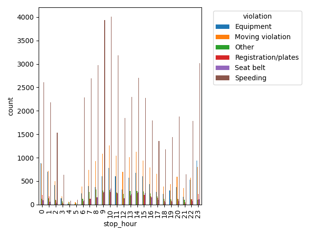
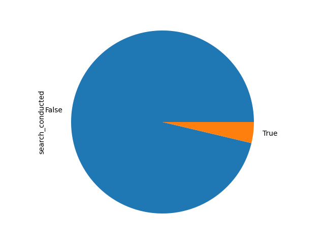
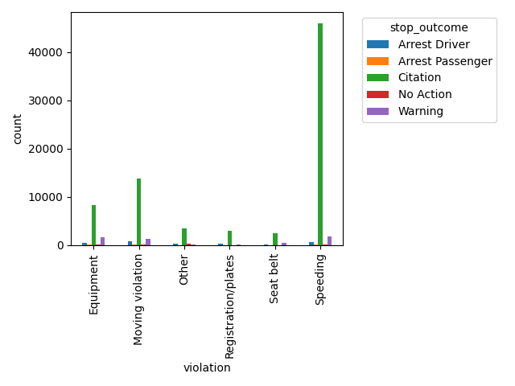

## Column: violation
- **Datatype:** String
- **Values:** Equipment, Moving violation, Other, Registration/plates, Seat belt, Speeding 
- **Description:** Describes the violation the person has committed

**Observations**
- Speeding is the most frequently committed violation throughout the day
- Number of violations peak between 9AM-11AM and again between 10PM-1AM
- 4AM-5AM has the least number of violations

## Column: search_conducted
- **Datatype:** Boolean
- **Description:** Describes if any search was conducted by the police officer after the vehicle was stopped

**Observations**
- Most of the stops don't cause a search to be conducted by the police offer
- This column does not provide any significant value to the dataset itself

**Result:** This column can be deleted

## Column:  search_type
- **Datatype:** String
- **Values:** Intend to Arrest, Probable Cause, Inventory, Reasonable Suspicion, Protective Frisk
- **Description:** Describes what type of search was conducted by the police officer after the vehicle was stopped

**Observations**
- Some stops had multiple searches conducted and this was recorded as comma separated values. When a single stop had multiple searches conducted, each search type was split into its own row so that all the values in this column are atomic
- Incident to arrest is the most common search_type that has occurred

## Column:  stop_outcome
- **Datatype:** String
- **Values:** Arrest Driver, Arrest Passenger, Citation, N/D, No Action, Warning
- **Description:** Describes what type of search was conducted by the police officer after the vehicle was stopped

**Observations**
- Citation is the most common outcome for any kind of violation